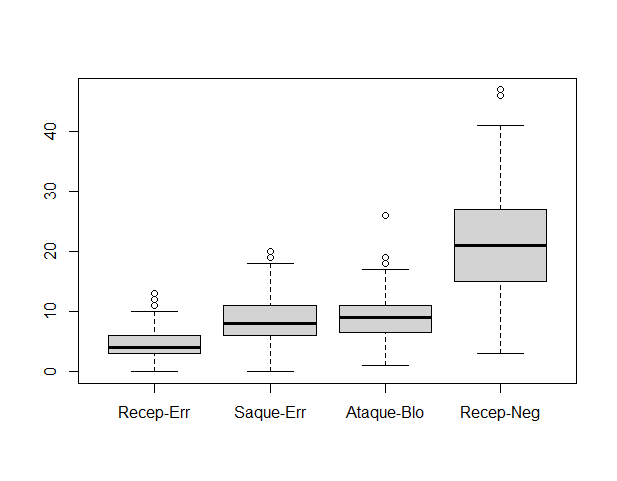
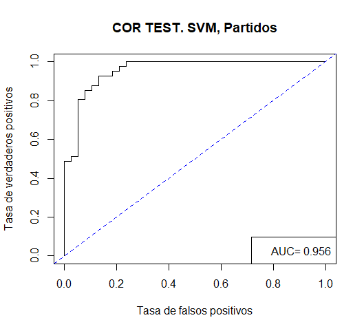

```{r include=FALSE}
knitr::opts_chunk$set(fig.path = 'figurasR/',
                      echo = FALSE, warning = FALSE, message = FALSE,
                      fig.pos="H",fig.align="center",out.width="95%",
                      cache=FALSE)

```

<!-- \setcounter{chapter}{2} -->

<!-- \setcounter{chapter}{2} escribir 2 para capítulo 3  -->

<!-- \pagenumbering{arabic} -->

```{=tex}
\ifdefined\ifprincipal
\else
\setlength{\parindent}{1em}
\pagestyle{fancy}
\setcounter{tocdepth}{4}
\tableofcontents
```
<!-- \nocite{*} -->

\fi

```{=tex}
\ifdefined\ifdoblecara
\fancyhead{}{}
\fancyhead[LE,RO]{\scriptsize\rightmark}
\fancyfoot[LO,RE]{\scriptsize\slshape \leftmark}
\fancyfoot[C]{}
\fancyfoot[LE,RO]{\footnotesize\thepage}
\else
\fancyhead{}{}
\fancyhead[RO]{\scriptsize\rightmark}
\fancyfoot[LO]{\scriptsize\slshape \leftmark}
\fancyfoot[C]{}
\fancyfoot[RO]{\footnotesize\thepage}
\fi
\renewcommand{\headrulewidth}{0.4pt}
\renewcommand{\footrulewidth}{0.4pt}
```
# Capítulo 3

## Creación de la base de datos

### Procedencia de los datos

Los datos han sido extraídos de la web oficial de la Real Federación Española de Voleibol @federacionvoleibol2021, en la que podemos encontrar estadísticas de todas las competiciones profesionales, tanto masculinas como femeninas, del voleibol español.

Se han recogido los datos de la Liga Iberdola de la temporada 2020/2021. Es conocida con ese nombre por motivos de patrocinio pero se refiere a la Superliga Femenina de Voleibol, es decir, la liga femenina de voleibol de máxima categoría en España. Nació en 1970, organizada por la Real Federación Española de Voleibol. El sistema de competición para determinar su posición en la clasificación consiste en dos vueltas en las que se enfrentan todos contra todos. Una vez terminada esa fase regular, los cuatro primeros equipos de la clasificación se vuelven a enfrentar en una eliminatoria al mejor de cinco partidos donde finalmente se proclama un ganador.

En la página correspondiente a la Liga Iberdola de la temporada 2020/2021, dentro del apartado *Estadísticas* se ha seleccionado *Detalles por equipos*. De cada equipo, se han utilizado solo los datos acerca de cada partido jugado (no se han utilizado los datos totales ni en porcentaje), de forma que por cada equipo tenemos 22 registros que corresponden a los 22 encuentros en los que han participado.


Los datos se han extraído mediante el portapapeles utilizando *Excel*, creando un archivo con formato .*xlsx* llamado *Partidos_20_21.xlsx*. Luego, hemos obtenido una base de datos con 264 registros y 26 variables.

### Modificaciones en la base de datos

En esta misma hoja de cálculo, hemos realizado las siguientes modificaciones:

-   La primera columna de nuestra base de datos se corresponde con los equipos que han participado en el encuentro (*ejemplo: "FC Cartagena - Algar Surmenor --- Madrid Chamberí"*) . Como de cada partido nos interesan las estadísticas por separado de cada equipo, hemos modificado la variable renombrándola como **Equipo**. En cada registro entonces se hace referencia al equipo del que hemos extraído las datos correspondientes.

-   Se ha añadido una variable que nos será muy relevante en nuestro estudio. A esta variable la llamaremos **Ganado/Perdido** y nos indica con un 0 o un 1 si el equipo correspondiente a ese registro ha perdido o ganado ese partido, respectivamente.

-   Hemos renombrado las variables correspondientes a cada acción técnica, con el fin de evitar confusión entre variables con nombres iguales o similares. De esta forma, se ha añadido el nombre de la acción a la que se refiere la variable al principio de cada una de ellas (*ejemplo: "Saque-Tot","Recep-Tot"*).

-   Se ha encontrado un error en el registro número 245, en las estadísticas de "Sanaya Libby's La Laguna" correspondientes al partido contra "Osacc Haro Rioja Voley". La columna "Tot" es el resultado de sumar las columnas "Saque-Pts" , "Ataque-Exc" y "Bloqueo-Pts". El valor de "Tot" para ese registro es 51 que no coincide con la suma de los valores correspondientes (4 + 35 + 13). Finalmente, buscando en la pestaña *Encuentros* en la web @federacionvoleibol2021 el partido "Sanaya Libby's La Laguna --- Osacc Haro Rioja Voley" hemos encontrado la ficha de *DataVolley* en la que el valor de "Bloqueo-Pts" no coincide con el valor anterior. De esta forma, los valores para las columnas "Tot" y "Bloqueo-Pts" se han cambiado por `50` y `11` respectivamente.

Finalmente, queda una base de datos formada por 264 registros con 27 variables que describen las estadísticas correspondientes a todos los encuentros jugados durante esa temporada.

## Descripción de los datos

### Breve descripción de las acciones técnicas

Para poder introducir las variables necesitamos saber cuáles son las principales acciones técnicas del voleibol, que se recogen en @accionestecnicas:

-   Saque: acción de poner en juego el balón por el jugador zaguero derecho situado en la zona de saque, es decir, uno de los atacantes de detrás de la linea de 3 metros que divide la zona de ataque delantera.

-   Recepción: interceptar y controlar un balón dirigiéndolo hacia otro compañero en buenas condiciones para poder jugarlo. Los balones bajos se reciben con los antebrazos unidos al frente a la altura de la cintura y los altos con los dedos, por encima de la cabeza.

-   Ataque: toda acción de dirigir el balón al campo del adversario, excepto el saque y el bloqueo, se considera golpe de ataque.

-   Bloqueo: acción de los jugadores cerca de la red encaminada a interceptar el balón que procede del campo contrario por encima del borde superior de la red. Sólo los delanteros pueden completar un bloqueo. Está prohibido bloquear el saque adversario.

### Variables del estudio

En este estudio se ha trabajado con 18 variables, que se han seleccionado a través del **software Rstudio**, al igual que el resto de modificaciones que se han llevado a cabo con el resto datos. Las variables estudiadas son las siguientes:

-   Equipo: equipo al que corresponden las estadísticas extraídas de la base de datos para ese partido.

-   Sets jugados: número de sets que se han jugado en el partido. Un partido de voleibol se juega al mejor de 5 sets y un equipo gana un set cuando llega a un total de 25 puntos con una ventaja de 2 puntos con respecto a los del equipo contrario. El quinto set se juega a 15 puntos.

-   BP: (break-point) puntos que se consiguen cuando el equipo está sacando, es decir, manteniendo el saque.

-   G: puntos conseguidos cuando el saque ha correspondido al equipo contrario.

-   Saque-Tot: número de saques totales realizados durante el partido.

-   Saque-Pts: puntos totales conseguidos con un saque directo, es decir, aquél saque en el que el balón cae directamente en el campo del equipo contrario.

-   Saque-Err: número de saques fallados.

-   Recep-Tot: número de recepciones totales realizadas durante el partido.

-   Recep-Err: número total de errores en las recepciones durante el partido.

-   Recep-Neg: número de recepciones "negativas" entendiéndose por "negativas" aquellas en las que el balón va a la zona verde del campo.

```{r}
# 
```

-   Recep-Exc: número de recepciones perfectas, aquellas en las que se dirige el balón a la zona roja (zona donde se encuentra el colocador para realizar el segundo toque), de forma que sea más fácil construir una jugada.

-   Ataque-Tot: número de acciones de ataque realizadas durante el partido.

-   Ataque-Err: número total de errores en ataques (mandados fuera del campo o que no han pasado la red) durante el partido.

-   Ataque-Blo: número total de ataques que han sido bloqueados durante el partido.

-   Ataque-Exc: número de puntos que se han conseguido con un ataque durante el partido.

-   Bloqueo-Red: número de acciones de bloqueo en las que se ha tocado la red.

-   Bloqueo-Pts: puntos conseguidos por el bloqueo durante el partido.

-   Ganado/Perdido: variable de tipo factor que toma valores 0 o 1 en función de si el equipo ha ganado o perdido el partido, respectivamente.

Como hemos indicado en los objetivos del trabajo, nuestro fin es buscar un modelo que sea capaz de predecir según las acciones que realiza un equipo durante un partido si lo gana o lo pierde. De esta forma, nuestra variable respuesta será la variable *Ganado/Perdido*.

### Análisis de los datos

#### Valores atípicos (outliers)

Mediante gráficos de caja y bigotes, utilizando la función *boxplot()*, observamos que hay "valores atípicos" en algunas de las variables. En las variables *Recep-Err*, *Saque-Err*, *Ataque-Blo* o *Recep-Neg*, estos valores indican que ha habido muchos fallos en acciones técnicas durante el partido. Esto puede indicarnos que la probabilidad de que los equipos hayan perdido esos partidos es mayor.

{width="449"}

En cambio, en variables como *Saque-Pts*, *Bloqueo-Pts* o *Recep-Exc*, que los valores sean mayores también pueden ayudarnos a distinguir si se ha ganado o no el partido.

{width="449"}

#### Correlaciones

Analizamos las correlaciones entre las variables explicativas para ver si encontramos problemas de multicolinealidad, de forma que dos o más variables expresen información similar. El determinante de la matriz de correlaciones nos da un valor muy cercano a 0, lo que significa que hay variables con una alta correlación. Las variables con una correlación mayor a 0.85 son:

TABLA

Para intentar solucionar este problema de multicolinealidad se ha realizardo un análisis de componentes principales que, finalmente, no nos ha resultado de utilidad puesto que las componentes principales seleccionadas no se pueden interpretar de una forma sencilla con respecto a las variables.

## Modelos de predicción

En este apartado vamos a describir los modelos de predicción que mejor se han ajustado a los datos. Previamente, se ha realizado un estudio de los principales modelos estadísticos, mediante una partición de los mismos en muestra de entrenamiento y muestra test (70%-30%).

### Redes Neuronales

El objetivo de este modelo estadístico... (capítulo 2)

#### Descripción

Se ha ajustado un modelo utilizando la librería *caret*, con la función *train* mediante el método *nnet*. Para el tamaño de la capa oculta se ha probado con valores de 1 a 18 (que es el número de variables del estudio) y para valores del parámetro $\lambda$ se ha evaluado en 0, 0.05 y 1.

La red final es *16-2-1 network with 37 weights, decay=0.1*, es decir, está formada por la capa de entrada con las variables predictoras, una capa oculta con dos neuronas y la capa de salida, de forma que en total hay 37 pesos. El parámetro $\lambda$ (término de penalización en la función de error cuyo objetivo es reducir el sobreajuste,memoriza los datos de entrenamiento pero es incapaz de predecir correctamente nuevas observaciones) óptimo ha sido **0.1** .


#### Evaluación (tabla de confusión)

Al evaluar en la muestra test obtenemos la siguiente matriz de confusión:

(matriz de confusión)

De aquí se deduce lo siguiente:

-   Hay 38 "verdaderos negativos", es decir, partidos que se han perdido y que el modelo los ha clasificado como perdidos.

-   Hay 3 "falsos positivos", es decir, partidos que se han perdido y que el modelo ha clasificado como ganados.

-   Hay 5 "falsos negativos", es decir, partidos que se han ganado y han sido clasificados como perdidos por el modelo.

-   hay 33 "verdaderos positivos", es decir, partidos ganados y que han sido clasificados como ganados por el modelo.

Luego la probabilidad de acierto para el modelo del Perceptrón multicapas es del 89.97%, y para cada valor de la variable *Ganado/Perdido* las probabilidades de acierto son 92.68% para la clase *Perdido* y 86.84% para la clase *Ganado*.

Para terminar con la eficacia de este modelo, tenemos la representación gráfica de la curva ROC y el correspondiente valor del área bajo la curva, AUC, 0.9415918.


### Vectores soporte

Objetivo...

#### Descripción

Al igual que en el modelo anterior, se ha utilizado la función *train* para el desarrollo del modelo pero esta vez con el método *svmRadial*. Este método utiliza la función núcleo de base radial gaussiana. El parámetro **C**, como ya hemos visto, indica cómo de severo y el número de violaciones del margen. Los valores que se han probado para este han sido 0.1, 1, 5, 10, 50 y para el parámetro $\gamma$ han sido 0.025,0.035 y 0.5. En este caso $\gamma$ está relacionado con la flexibilidad del modelo.

El modelo final que hemos obtenido tiene como parámetros **C = 1** y$\sigma$ **= 0.025**

#### Evaluación

Evaluando el modelo con la muestra test, obtenemos los siguientes resultados:

(Matriz de confusión)

En este caso, al tener 38 "verdaderos negativos" y 31 "verdaderos positivos" la probabilidad de acierto para este modelo es 87.34%, algo menor que para el Perceptrón multicapas. Las probabilidades de acierto por clases son 92.68% y 81.58%, para la clase "Perdido" y para la clase "Ganado", respectivamente.

Con respecto a la curva ROC y el valor del área bajo la misma, AUC de 0.9557125, vemos que es algo mayor que para el modelo anterior, aunque la probabilidad de acierto sea menor.



#### Observaciones

La dimensión de nuestra muestra de entrenamiento según las clases de la variable respuesta no es balanceada, tenemos 92 casos para la clase *Perdido* y 93 casos para la clase *Ganado*. Como hemos visto en el capítulo 2, cuando nos encontramos con esta situación podemos utilizar la técnica Up-Sampling. La diferencia en los tamaños de las muestras es mínima luego, en principio, no sería necesario utilizar esta técnica. De todas formas, se ha querido comprobar si los resultados difieren con los obtenidos anteriormente.

Después de aplicar Up-Sampling a los datos y obtener una muestra de entrenamiento balanceada, se ha aplicado el modelo de Máquinas de Vectores Soporte. El modelo final obtenido (utilizando la misma función núcleo) tiene como parámetros **C = 5** y$\sigma$ **= 0.025**.

Una vez realizada la evaluación del modelo, a partir de la matriz de confusión,

[Matriz confusión SVM con up-sampling]()

vemos que la probabilidad de acierto es mayor que en el modelo SVM, 89.87%, debido a que difieren también las probabilidades de acierto por clases, 90.24% para la clase *Perdido* y 89.47% para la clase *Ganado*.

En cuanto a la curva ROC, el AUC es 0.9505777, muy parecido al del modelo anterior.


### Conclusiones
